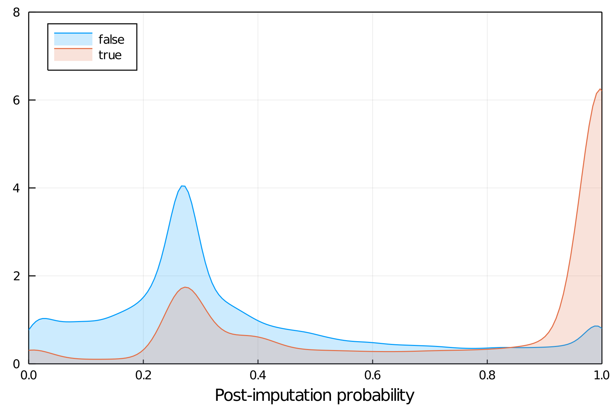
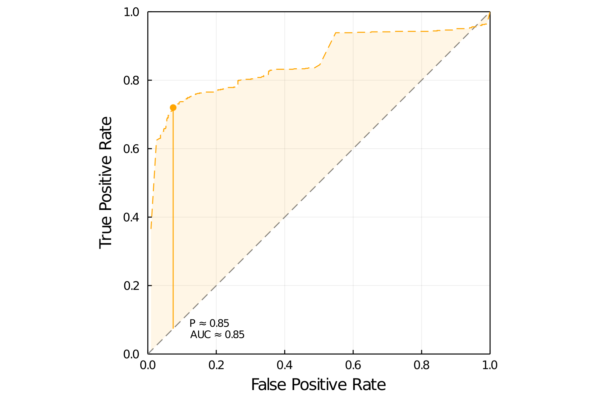
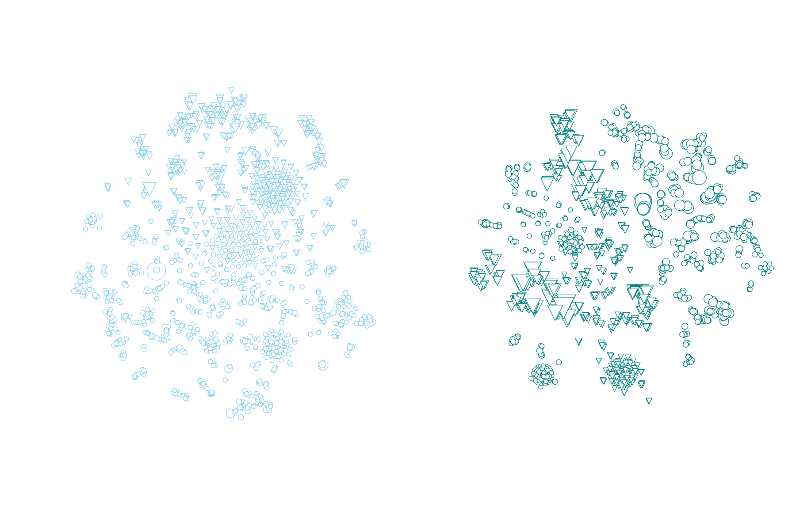
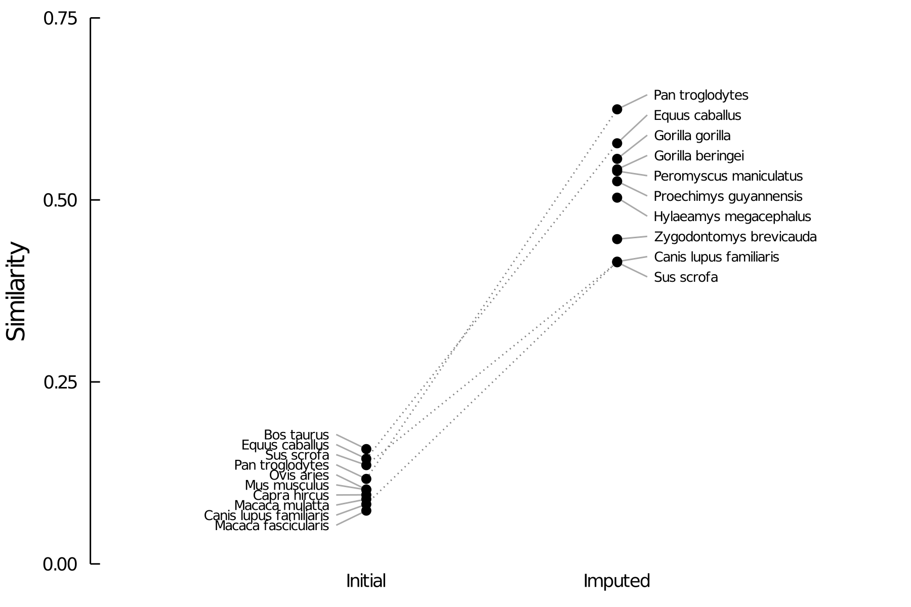
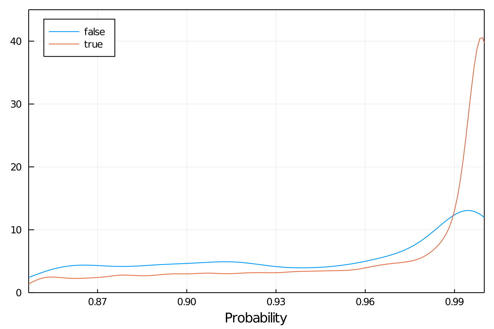
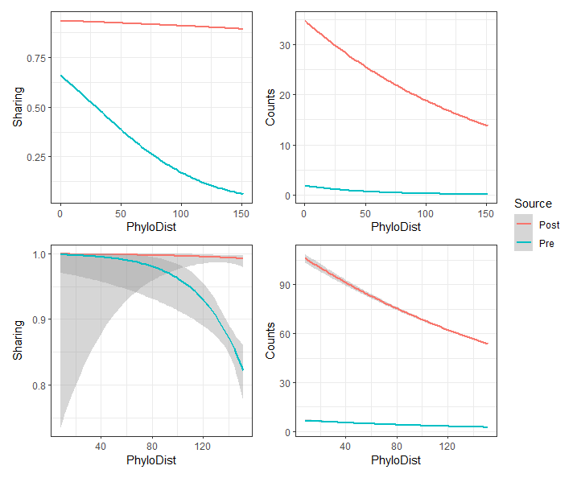

# A model-inflated list of potential host-virus associations

C'est quoi, `trefle`?

It is a data product derived from the [`clover`][clover] database of
mammals-virus association. Specifically, `trefle` was produced using LF-SVD
imputation, a two-step algorithm where novel host-virus associations are
recommended based on truncated singular value decomposition applied to initial
values based on a linear filter.

[clover]: https://github.com/viralemergence/clover

## LF-SVD

Associations in `trefle` are recommended based on the output of a two-step
process. First [linear filtering][LF] is used to generate an initial value based
on network properties. The linear filter has four hyper-parameters (the four
weights assigned to the initial association, the connectance, and the in and out
degree of the nodes), constrained as their values must sum to one.

[LF]: https://www.nature.com/articles/srep45908

Second, we apply truncated SVD to the modified `clover` wherein the missing
association we impute get its initial value from to the linear filter. The rank
of truncation for the low-rank approximation is a fifth hyper-parameter in this
model.

In short, `trefle` is a giant LOOCV dataset. This has consequences for how much
computational resources are required to *produce* it, which we will approximate
as: hella. We will discuss the computational requirements more below.

## Hyper-parameters tuning

In practice, we can get away with removing the first hyper-parameter of the
linear filter, as we have reasons to suspect that negative associations can
often be false negatives. This leaves us with four hyper-parameters to tune.

Because exploring the grid of linear filter parameters would be prohibitive in
terms of computing time (but also would lead to less interpretable model
inputs), we picked three initial models: the initial value is the same for all
associations and determined by the connectance of `clover` (`connectance`); the
initial value is given by the averaged relative degree of the host and the virus
(`degree`); the initial value is given by the average of the previous two models
(`hybrid`).

We applied each model at various depth of low-rank approximation, *i.e.* by
truncating the SVD to its 1st to 20th singular value. Within each model-rank
combination, we imputed the value of 780 positive interactions (which we should
assume are true positive given the nature of the `clover` data), and of 780
negative interactions (about which we will refrain from making assumptions),
using LOOCV.

The performance of each model-rank combination was measured using ROC-AUC,
assuming that negative interactions are true negatives. Note that owing to the
dimensions of `clover`, the training sample represents less than 1/1000 of the
entire dataset. Further, for each model we decided on a threshold of evidence
above which the pseudo-probability should be indicative of an actual association
by picking the value of evidence which maximizes Youden's J statistic. In the
overwheling majority of cases, this value of evidence *also* maximized the
accuracy of the model.

## Output values

The output value in `trefle` is akin to an association probability (but it is
not a probability of association in the sense of [probabilistic ecological
networks][pen]). The final value after imputation is divided by the initial
value before imputation. If the association "score" does not change, this gives
a value of 1. We transform this by substracting one from the result, yielding an
*evidence* value for the association: positive evidence makes the association
more likely. To convert the evidence into a pseudo-probability, we put it
through the logistic function. This returns values in [0;1]. In practice, owing
to the numerical imprecisions involved in measuring the logistic on even
moderately large floating-point numbers on 64 bits, it is common to have final
pseudo-probability values of 1, and we rely on the *evidence* for ranking.

[pen]: https://besjournals.onlinelibrary.wiley.com/doi/10.1111/2041-210X.12468

The following figure is an illustration of the resulting probabilities in an ensemble model of all of the model candidates used during tuning - the little bump in values that are `false` around 1 are candidate false negatives:

## Model performance

### Top 10 models

The following table has the 10 best models ranked from first to last, as well as
the usual measures of model performance derived from the confusion table. In
addition to the AUC and cutoff (expressed as a *pseudo-probability*), we report
the true positive and true negative rates (TPR, TNR), the positive and negative
predictive values (PPV, NPV), the false negative and positive rates (FNR, FPR),
the false discovery and false omission rates (FDR, FOR), the critical success
index (CSI), accuracy (ACC), and Youden's J.

| model         | rank | AUC   | cutoff | TPR   | TNR   | PPV   | NPV   | FNR   | FPR   | FDR   | FOR   | CSI   | ACC   | J     |
|---------------|------|-------|--------|-------|-------|-------|-------|-------|-------|-------|-------|-------|-------|-------|
| `connectance` | 12   | 0.849 | 0.846  | 0.720 | 0.925 | 0.906 | 0.769 | 0.28  | 0.074 | 0.093 | 0.230 | 0.669 | 0.823 | 0.645 |
| `connectance` | 11   | 0.846 | 0.908  | 0.684 | 0.936 | 0.914 | 0.75  | 0.315 | 0.063 | 0.085 | 0.25  | 0.643 | 0.811 | 0.621 |
| `connectance` | 17   | 0.844 | 0.929  | 0.692 | 0.935 | 0.913 | 0.754 | 0.307 | 0.064 | 0.086 | 0.245 | 0.649 | 0.814 | 0.627 |
| `connectance` | 8    | 0.842 | 0.705  | 0.701 | 0.895 | 0.868 | 0.751 | 0.298 | 0.104 | 0.131 | 0.248 | 0.634 | 0.798 | 0.596 |
| `hybrid`      | 12   | 0.841 | 0.707  | 0.703 | 0.877 | 0.851 | 0.748 | 0.296 | 0.122 | 0.148 | 0.251 | 0.626 | 0.790 | 0.581 |
| `connectance` | 14   | 0.839 | 0.902  | 0.700 | 0.929 | 0.907 | 0.758 | 0.299 | 0.070 | 0.092 | 0.241 | 0.653 | 0.815 | 0.629 |
| `hybrid`      | 11   | 0.837 | 0.820  | 0.647 | 0.918 | 0.888 | 0.723 | 0.352 | 0.081 | 0.111 | 0.276 | 0.598 | 0.783 | 0.566 |
| `connectance` | 5    | 0.836 | 0.931  | 0.660 | 0.940 | 0.916 | 0.735 | 0.339 | 0.059 | 0.083 | 0.264 | 0.623 | 0.800 | 0.600 |
| `connectance` | 7    | 0.836 | 0.948  | 0.655 | 0.957 | 0.939 | 0.735 | 0.344 | 0.042 | 0.060 | 0.264 | 0.628 | 0.806 | 0.613 |
| `connectance` | 16   | 0.835 | 0.961  | 0.667 | 0.945 | 0.923 | 0.741 | 0.332 | 0.054 | 0.076 | 0.258 | 0.632 | 0.807 | 0.613 |

Following these results, we have conducted the imputation with on the model
based on connectance and a rank 12 approximation. Visualisations of all these
metrics are provided in `model_performance/metrics`.

### Overview of the best model

The following figure is the ROC AUC, with a depiction of the point maximizing
Youden's J and the probability cutoff associated:

Visualisations of the same curve for all model-rank combinations are in
`model_performance/roc`.
## Computational resources

We assembled `trefle` on the [beluga][beluga] supercomputer, operated by *Calcul
Québec*, using a pipeline built entirely in [Julia][jl] (1.5.2).

[beluga]: https://www.computecanada.ca/featured/beluga-the-latest-supercomputer-for-canadian-researchers/
[jl]: https://julialang.org/

Tuning the hyper-parameters required about 2400 core hours, and imputation took
approximately 59500 core hours. Rounding up, using recent ARC hardware, the
assembly of `trefle` takes 62000 core hours, or just above 7 core years.
Assuming a cost of $0.051 per hour (equivalent to what a commercial cloud
computing provider would charge), the entire `trefle` production process costs
about $3200.

Dealing with the `artifacts/tuning.csv` and `artifacts/predictions.csv` is
*considerably* less demanding. The project comes bundled with a `Project.toml`
which specifies the dependencies, and the compatible major/minor releases of the
packages. The `hpc/inputs` folder also comes with its `Manifest.toml` file, to
ensure that we would get the same environment should we decide to run the code
again (but see the previous paragraph for why this is unlikely).

## How to use `trefle`

The output of running the pipeline is a *prediction* (specifically based on a binary
classifier) for host-virus associations that are likely to exist given what we know
about true positives (*i.e.* the content of `clover`). These recommended interactions are
*not* actual observations, and should not be treated as such.

🧑‍⚖️ Let's talk about licensing, said no one ever. The `trefle` repo is a
complex beast with data from other projects, code to work on it, and derived data products
from both of these things. As a result, intellectual property and
use rights are applied *within each top-level folder*. A folder that has *no
`LICENSE` file in it* is understood to contain information that should not be
re-used or re-distributed. This is notably the case for `data/`, which contains
information from other projects. Note that the repo has a `LICENSE` (CC-BY 4.0)
file at its root, which cover this `README`, and *all images present within this
project* All derived data (in `artifacts`) are released under the CC0 waiver and
are usable without condition or restriction. Re-use of content under CC-BY 4.0
should mention the URL to this repository and credit "The VERENA consortium".

⚠️ Discussions about intellectual property notwithstanding, `trefle` should most
likely not be merged into your own database. The associations are *predictions*,
and we can estimate how many of them are false positives, and how many are
missing (but we do not know which are which). In addition, the probability score
is not a biologically meaningful probability. Unless your database is able to
accommodate these subtleties and convey them clearly to the user, we advise you
against consuming `trefle` to re-distribute as part of another database.

Contact: `timothee.poisot@umontreal.🇨🇦`

## Repository content

- `hpc` contains all the code used to run the tuning and simulation using `slurm`
    - `inputs` is the main location for the bash scripts and helper functions
    - `outputs` is where the output files are located -- note that they are not written here by default, this was us doing some post-processing
        - `tuning.csv` is the file for model selection (about 6MB)
        - `predictions.csv` is the output of imputation (about 85MB)
    - as a side-note, each thread is responsible for its own files (and works on its own copy of the data, so think about memory use)
    - as an additional side-note, not all species pairs in `clover` are in `trefle`, because some proportion (<1%) of runs fail for reasons that always mean that the association is [almost surely][almost_surely] not happening
- `data` is storing all the data that are *not* directly generated by `trefle`
- `model_performance` has the file for model selection *and* the figures generated as part of this process
    - `roc` has all the plots of ROC-AUCs
    - `metrics` has the plots of all metrics presented in the table above
- `imputation` has the files to read the data from `hpc/outputs` and do the analyses
- `artifacts` has derived data tables
    - `modelselection.csv` is the list of all models considered during hyper-parameters tuning
    - `imputed_associations.csv` is the list of all suspected positive associations (~ 6MB) - associations are ranked from least to most likely
    - `zoonoses.csv` is the list of the subset of suspected positive associations involving *H. sapiens* - associations are ranked from least to most likely
    - `trefle.csv` is the edgelist of `clover` plus the imputed associations, sorted by virus name (~ 3MB)
    - `phylo_distance_to_human.csv` is the phylogenetic distance between *H. sapiens* and other taxa in the Upham tree
    - `sharing-phylogeny.csv` is a table with the Jaccard similarity of viruses, number of shared viruses, and phylogenetic distance between pairs of hosts -- it contains both the *before* and *after*  imputation step
- `demo-phylogeny` contains a visualization of phylogenetic signal to the data and predictions as a use case vignette 
- `R` has `.r` files to read the phylogeny

[almost_surely]: https://en.wikipedia.org/wiki/Almost_surely

## Main results

This section will grow as we develop more analyses.

### Imputation changes the network

The LF-SVD approach suggested 75901 new interactions, from the original 5494 in
`clover`. With a total of 81395 interactions, `trefle` has a connectance of
0.09, which is well within the range of connectances for antagonistic bipartite
networks.

The following figure is the result of a 2-dimensional tSNE embedding of `clover`
(left) and `trefle` (right):

Not only can we see an increase in the degree of most nodes, we can also see the
shape of the network change, with less clusters of mostly homogenous species.

### Top 10 predicted *H. sapiens* viruses

| Host         | Virus                       | Evidence |
|--------------|-----------------------------|----------|
| Homo sapiens | **Torque teno virus 2**     | 182.4210 |
| Homo sapiens | **Torque teno virus 23**    | 187.3940 |
| Homo sapiens | Panine betaherpesvirus 2    | 187.3940 |
| Homo sapiens | **Torque teno virus 4**     | 187.3940 |
| Homo sapiens | **Torque teno virus 14**    | 187.3940 |
| Homo sapiens | Carnivore protoparvovirus 1 | 191.2557 |
| Homo sapiens | Phocid alphaherpesvirus 1   | 191.4652 |
| Homo sapiens | Panine gammaherpesvirus 1   | 201.9715 |
| Homo sapiens | Simian mastadenovirus A     | 242.8597 |
| Homo sapiens | Canine mastadenovirus A     | 275.6808 |

### Imputation removes the livestock bias

The original data that went into `clover` had a lot of information about
livestock viruses. In the following figure, we show the ten species most similar
(using Additive Jaccard Similarity) to *H. sapiens* before and after imputation:

Strikingly, if not unexpectedly, the hosts with viral associations most similar
to human after imputation are mostly primates (chimpanzees and both gorilla
species). Some rodents are also joining the top 10. This result suggests that
the LF-SVD approach is able to somewhat overcome the initial data bias.

### LF-SVD predicts associations between species not shared by databases

In the next figure, we look at the probability of association as a function of
whether the two species were reported as part of the same database that went
into making `clover`:

There is little to report here - the method is indeed able to predict
associations between species that were non-overlapping across data sources. Due
to the effort that went into reconciling the taxonomic names in `clover`, the
final amount of overlap is rather large anyways.

### Predicted associations have a strong phylogenetic plausibility

The below figure shows pre- and post-imputation host sharing networks analyzed as a function of phylogenetic distance between hosts, pairwise across the entire network (top) and hostwise with humans (bottom), using either binary sharing of at least one virus (sharing) or total number of viruses shared (counts).

There are two main results:
1. The missing links recommended by SVD have a strong phylogenetic signal even though it's trait agnostic, implying the signal in the network is strong enough to be propagated by latent factor approaches. (SVD is good)
2. The less sparse the matrix becomes, the more we will need to move from thinking about sharing networks as binary networks to weighted ones, which is a bit of a change from the last 20 years of sharing work like the GMPD-based work (count data matters)

### Phylogenetic distance as a predictor of viral sharing

**Analysis in development**: @cjcarlson and @danieljbecker and @gfalbery

See `artifacts/sharing-phylogeny.csv`

## Get involved

If  you want to develop an analysis, **please open an issue** (and if you want to
start working, please make an explicitely named branch).

If you have to create new data files, please mind the current directory, and
when in dout, ask @tpoisot.

If you require a new data file to be created for you, ask @tpoisot.
